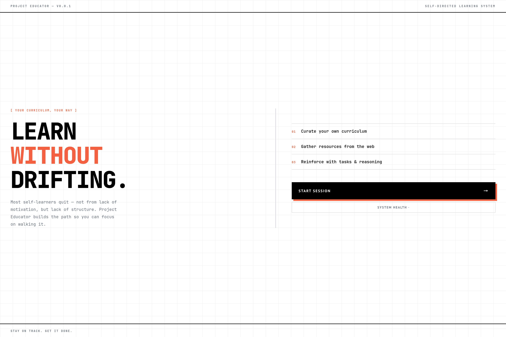
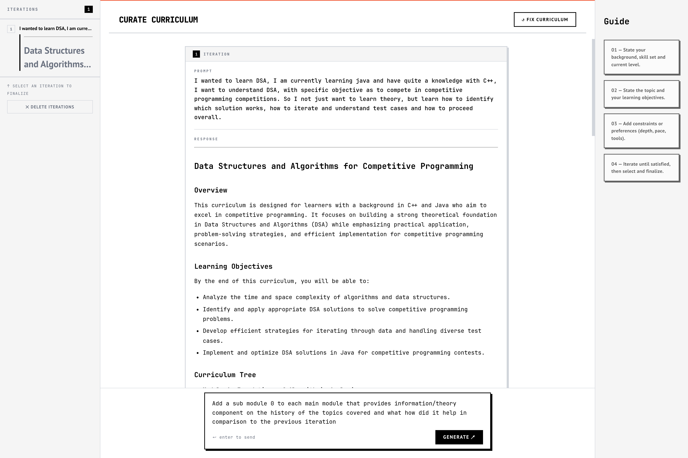

> **Work in Progress** — Curriculum generation is fully functional. Learning modules, assessment engine, and Socratic dialogue sessions are actively being built.

---

# Project Educator

Most self-learners quit - not from lack of motivation, but lack of structure. College-style curricula assume everyone learns the same way. They don't. Project Educator is an AI-powered self-learning system that builds a curriculum around *you* - your topic, your background, your goals. Grading is inferred through reasoning quality, not checkbox completion.

---

## Screenshots

<div align="center">
  
  &nbsp;
  
</div>

---

## Features

- **Curriculum Generator** — Describe your topic, skill level and objectives. The AI builds a structured curriculum with modules, topics, and learning objectives tailored to you.
- **Iterative Refinement** — Submit follow-up prompts to refine the curriculum. Each iteration is saved and selectable. Pick the version you want and finalize it.
- **Structured Finalization** — The selected curriculum is converted to a structured JSON object, ready to power the learning modules page (in progress).
- **AI-Inferred Grading** *(in progress)* — Understanding is assessed through Socratic dialogue, research tasks, and project reflection logs — not multiple choice.
- **Learning Modules** *(in progress)* — Module-by-module learning view with progress tracking.
- **Assessments** *(in progress)* — Homework tasks, research briefs, and ungraded projects with reflection.

---

## Tech Stack

| Layer | Technology |
|---|---|
| Frontend | Angular 21 |
| Backend | Node.js + Express |
| Database | MongoDB + Mongoose |
| AI | Google Gemini API |
| Streaming | Server-Sent Events (SSE) |
| Rendering | marked.js + KaTeX |

---

## Project Structure

```
educator/
├── frontend/               # Angular app
│   └── src/app/
│       ├── components/     # CurriculumChat, CurriculumSidebar, Input, Header
│       ├── services/       # ChatService (HTTP + SSE)
│       └── *.component.ts  # Page-level components
│
└── backend/
    ├── controllers/        # curriculum, health
    ├── services/           # llm, curriculum, ticket
    ├── models/             # User, Curriculum (Mongoose schemas)
    ├── routes/             # routes.js
    ├── config/             # db.js
    └── .env_sample         # copy to .env and fill in your values
```

---

## Getting Started

### Prerequisites

- Node.js v18+
- Docker — for the bundled MongoDB (or a free [MongoDB Atlas](https://www.mongodb.com/atlas) account)
- Google Gemini API key — [get one here](https://aistudio.google.com/app/apikey)
- Angular CLI — `npm install -g @angular/cli`

### 1. Clone the repo

```bash
git clone https://github.com/kshrs/educator.git
cd educator
```

### 2. Configure environment

```bash
cd backend
cp .env_sample .env
```

Open `.env` and fill in your values:

```env
API_KEY=your_gemini_api_key_here
MODEL_NAME=gemini-2.5-flash
PORT=3000

# --- Choose one MongoDB option below ---

# Option A: Docker (recommended — no account needed, runs locally)
MONGO_URI=mongodb://localhost:27017/db

# Option B: MongoDB Atlas (cloud — paste your connection string)
# MONGO_URI=mongodb+srv://<user>:<password>@cluster.mongodb.net/educator
```

### 3. Start MongoDB

**Option A — Docker** (uses the `docker-compose.yml` in the project root):

```bash
# from the project root
docker compose up -d
```

This spins up a MongoDB instance on port `27017`. Data persists in a Docker volume between restarts. Stop it with `docker compose down`.

**Option B — MongoDB Atlas:**

No local setup needed. Create a free cluster at [mongodb.com/atlas](https://www.mongodb.com/atlas), get your connection string, and paste it as `MONGO_URI` in your `.env`. Make sure your IP is whitelisted in Atlas Network Access.

### 4. Install and run the backend

```bash
cd backend
npm install
node src/server.js
```

Backend runs on `http://localhost:3000`.

### 4. Install and run the frontend

```bash
cd frontend
npm install
ng serve
```

Frontend runs on `http://localhost:4200`.

### 5. Check system health

Navigate to `http://localhost:4200` → click **System Health** on the start screen to verify your API key is set and the Gemini connection is live.

---
---

## How It Works

```
User describes topic + goals
        ↓
POST /api/curriculum/start       → creates Curriculum document in MongoDB
        ↓
POST /api/curriculum/iterate     → queues prompt, returns ticketID
        ↓
GET  /api/curriculum/iterate/:id → SSE stream → markdown renders live
        ↓
User refines, repeats as needed
        ↓
User selects preferred iteration
        ↓
POST /api/curriculum/finalize    → converts markdown → structured JSON
        ↓
(upcoming) Learning modules page   → module-by-module study view
```

---

## Grading Philosophy

Assessment is built on four signals, weighted by research on AI-inferred learning outcomes:

| Signal | Weight | Method |
|---|---|---|
| AI-Inferred Understanding | 50% | Socratic dialogue after each module |
| Research Tasks | 20% | 150-word brief per module |
| Homework Completion | 15% | Binary — done or not done |
| Project Reflection | 15% | Reflection log on ungraded project |

---

## Roadmap

- [x] Start screen
- [x] Curriculum generator with iterative refinement
- [x] Curriculum finalization to JSON
- [x] System health + config page
- [ ] Learning modules page
- [ ] Socratic dialogue assessment sessions
- [ ] Homework and research task tracking
- [ ] Progress dashboard

---
